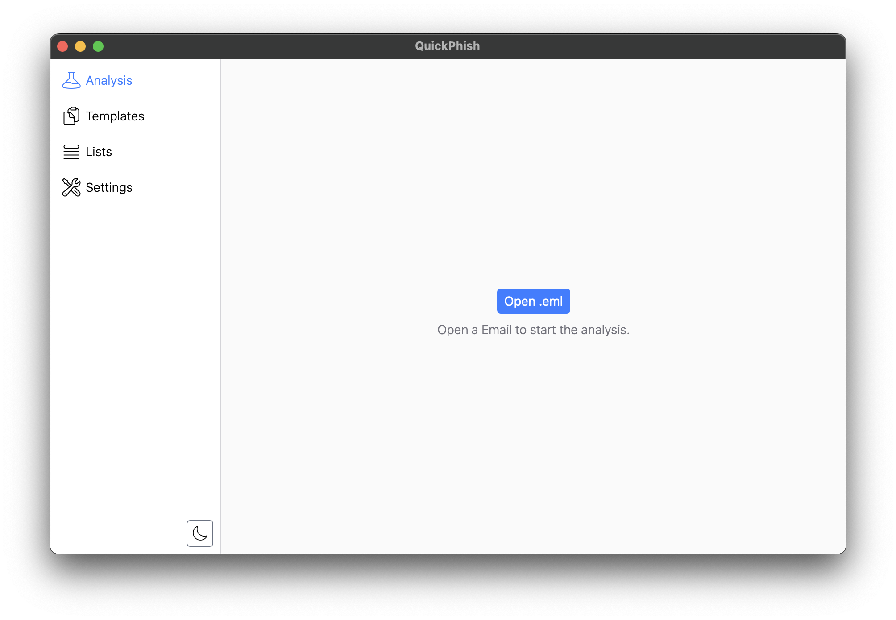
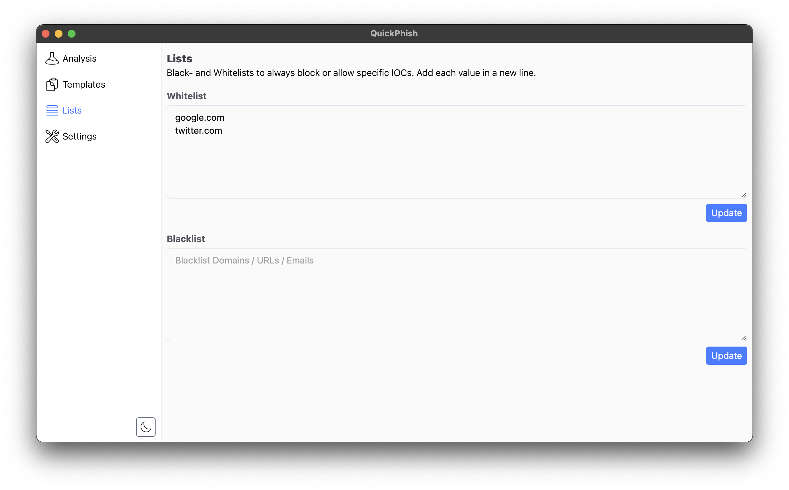
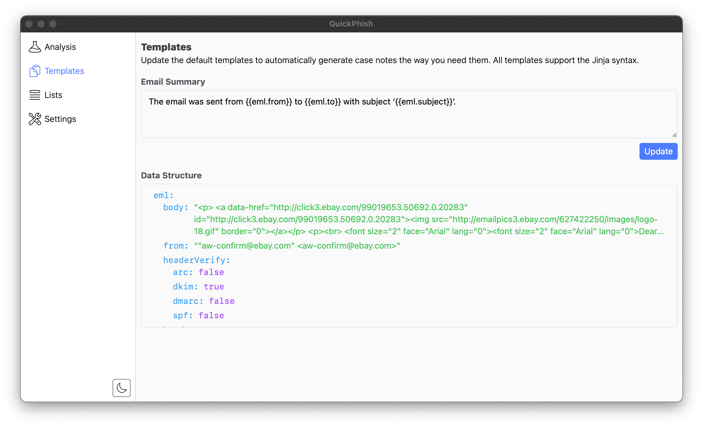
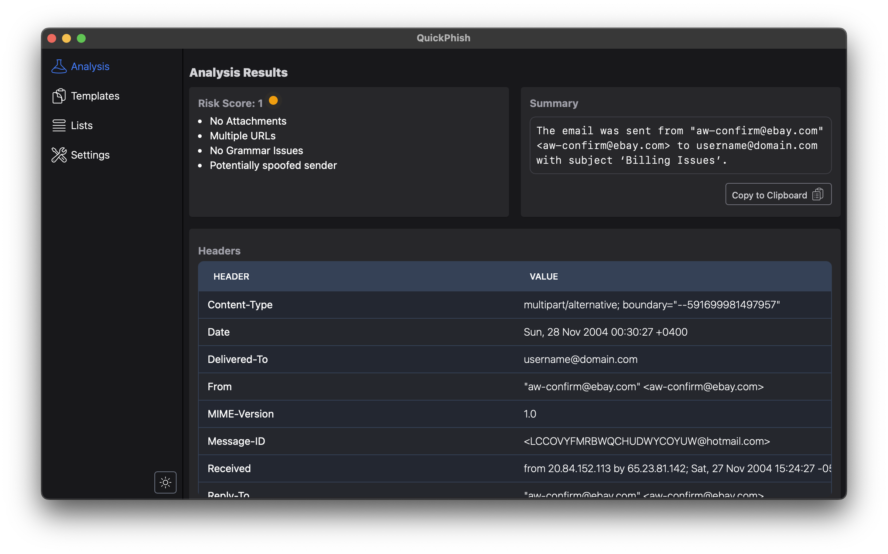

# QuickPhish 🐟

QuickPhish is a small application to quickly analyse phishing emails. The app is developed with Rust to support all OS and is a local desktop app to avoid having another browser tab somewhere open which you can't find anymore.

## Key Features 💯

- Offline Analysis (no data leaves the user's machine 💻)
- IOC extraction (URLs, domains, IP addresses, attachments)
- Generates custom case notes (just copy & paste 🤓)
- Customizable 
    - White- & Blacklist 
    
    - Custom Jinja Note Template
    
    - Light & Dark Theme
- User-friendly interface

## How it Works

Open a `.eml` file in **QuickPhish** and it will parse the email for you. It will write a quick summary for your case notes (using Jinja templates you can adjust yourself) and it will show you detailed information about the email, including:

- all headers extracted and displayed in table format
- all URLs and email addresses found in the email
- render of the email

## FAQ

### Can I use this tool for free?

Yes! I know a lot of cyber security tools cost more than my bank account will likely ever see. With this tool I want to help companies without a massive security budget. 

### Can I download a compiled version of this?

Not yet, right now this is still in very early development. Once I have the first version ready you will be able to directly download the exectuable. 

### How can I submit a feature request?

If you have any thoughts on how this tool could be improved or just generally would like to see a specific feature, please open a GitHub issue. I will review them and see what I can make! 👍

### When will the frist version be released?

I'm currently working on this on the side, so mostly weekend work, which means development is not as fast as I want, but I'm aiming of have the first release by the end of this year (2025).

### I have more questions!

Anything not mentioned here, feel free to reach out to me directly or visit my website [https://barracudabyte.de](https://barracudabyte.de).

## Frameworks

- Frontend with [TailwindCSS](https://tailwindcss.com)
- Icons from [HeroIcons](https://heroicons.com/outline)
- Backend with Rust & [Tauri](https://tauri.app/)